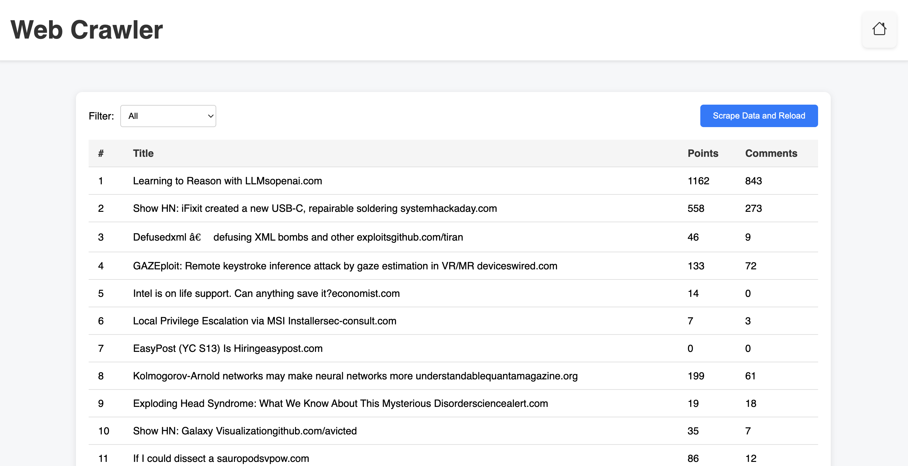

# Web Crawler (Frontend - React)

## Description
This is a frontend project built with React and Redux for displaying and filtering News entries scraped from an API.

[Backend Repository](https://github.com/Alexr16/WebCrawler_BackEnd)

## Features

- Displays a table of News entries
- Filters entries based on title word count
- Scrapes data from the backend and reloads entries
- Jest tests for components

## Technologies
- **Frontend**: React, Redux, React-Bootstrap, CSS
- **Testing**: Jest
  

## Screenshots




## Setup Instructions

### Installing Dependencies

1. Clone the repository:
   ```bash
   git clone <https://github.com/Alexr16/WebCrawler_FrontEnd.git>

2. Navigate to the project directory:
    ```bash
    cd frontend

3. Install dependencies:
    ```bash
    npm install

### Running the application
1. Start the server:
   ```bash
   npm start

### Running Test
1. To run the tests using Jest
   ```bash
   npm test
